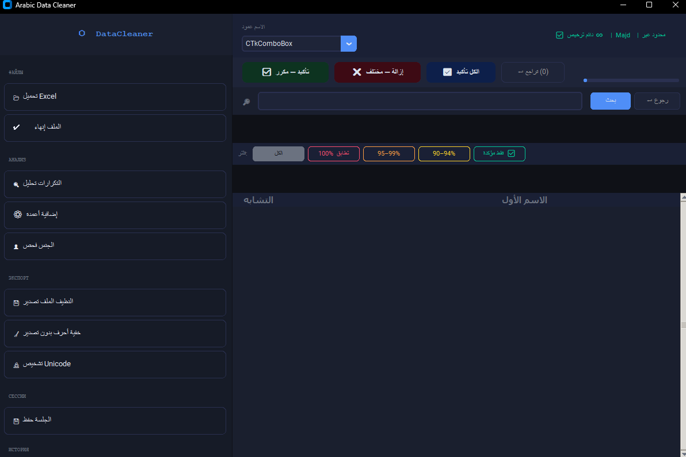

# Arabic Data Cleaner Pro

Professional desktop application for cleaning, validating, and analyzing Arabic Excel datasets.

---

## Screenshot

### Main Interface

---

## Features

- Arabic Data Cleaning
- Duplicate Detection
- Similarity Matching
- Arabic Name Analysis
- Medical Record Matching
- Patient Error Detection
- Unicode Normalization
- Gender Analysis
- Excel Data Processing
- Export Results
- Session Management
- License Management System

---

## Technologies

### Backend

- Python

### Data Processing

- Pandas
- OpenPyXL

### Interface

- CustomTkinter
- Tkinter

### Algorithms

- Arabic Name Matching
- Duplicate Detection
- Similarity Scoring

---

## Use Cases

- Hospitals
- Clinics
- Government Records
- Customer Databases
- Educational Institutions
- HR Systems

---

## Author

Mohamad Majd Al Baroudi

Information Systems Graduate  
AI Developer | Data Analytics | System Development

LinkedIn:
https://www.linkedin.com/in/mohamad-majd-al-baroudi/
